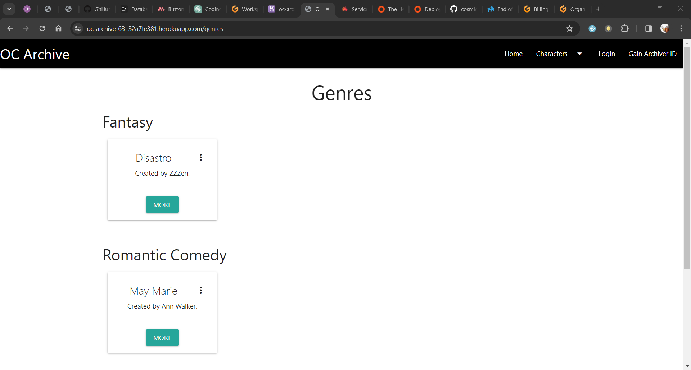

# OC Archive

Third Milestone Project for the Web Development course offered by Code Institute. An archive where users can submit their original characters for others to see and potentially use.

## Table of Contents
1. [UX](#ux)
	- [Project Goals](#project-goals)
	- [User Goals](#user-goals)
	- [User Stories](#user-stories)
	- [Design Choices](#design-choices)
2. [Planning](#planning)
	- [Wireframes](#wireframes)
3. [Future Additions](#future-additions)
4. [Testing](#testing)
	- [Bugfixes](#bugfixes)
5. [Technologies Used](#technologies-used)
6. [Deployment](#deployment)
7. [Credit](#credit)

## UX

### Project Goals

The OC Archive will be a site where users can upload original characters, or 'OCs', for perusal and potentially use in other people's works. Characters will be grouped by genre as well as creator, allowing users to narrow down a specific type of character or look at a specific user's contributions to the archive.

### User Goals

- Simple design.
- Visually appealing.
- Easy to navigate.

### User Stories

- As a user, I want a way to create characters.
- As a user, I want a way to edit my existing characters.
- As a user, I want a way to delete a character I don't want on the Archive.
- As a user, I want an account where all my characters can be stored.
- As a user, I want my characters to not be editable by other users.
- As a user, I want a way to find characters from the same genre (action, fantasy, slice of life, romance, and so on).
- As a user, I want a way to find characters by the same user.

### Design Choices

#### Interface
The OC Archive is a very simplistic design: a black navbar and white pages with plain black text.

When logged in, the site's navbar changes; the registration and login buttons are replaced by profile and logout buttons.

The logged in user can also edit and delete their characters from the characters pages.

Users have a profile page displaying all their characters, as well as an option to delete their account.

The site shifts to accommodate several screen sizes while keeping the same basic layout. The navbar is collapsed into a sidenav that can be expanded.

## Planning

### Wireframes
I did not create a wireframe for this project.

## Future Additions
- Addition of an administrator user system. Admins would be able to delete genres or remove users from the Archive.

## Testing

The site has been tested extensively to ensure the best user experience across multiple screen sizes.

The developer used **W3C CSS Validation Service** and **W3C Markup Validation Service** to check the validity of the HTML and CSS.

### Testing Process

In order to make sure the site renders acceptably across several screen sizes, I made liberal use of the DevTools offered by Google Chrome, as well as testing load times, mobile and desktop, with the Lighthouse Chrome extension.

### User Stories Testing

As a user of the site, I want:
- a way to create characters.
	- Ensured that a user could create any number of characters.
 	- Ensured that characters were properly added to the database when created. 
- a way to edit my existing characters.
	- Ensured that a user could edit their created characters.
 	- Ensured that character edits were properly added to the database.
- a way to delete a character I don't want on the Archive.
	- Ensured that a user could delete any character they created.
	- Ensured that deleting a character properly removed it from the database.
- an account where all my characters can be stored.
	- Ensured that the login system functions as intended.
	- Ensured that all characters are properly keyed to the users that created them.
- my characters to not be editable by other users.
	- Ensured that only the user that created a character could edit them (by only displaying the edit button for the correct user and forbidding other users from editing).
 	- Ensured that only the user that created a character could delete them (by only displaying the delete button for the correct user and forbidding other users from deleting).
- a way to find characters from the same genre (action, fantasy, slice of life, romance, and so on).
	- Ensured that the genres page correctly displays characters from each genre.
- a way to find characters by the same user.
	- Ensured that the users page correctly displays users from each genre.

### Bugfixes
- **Problem:** I could not access the site at all upon running the app, as ``current_user`` did not exist. This is despite me having imported all necessary components from ``flask_login``.
	- **Solution:** I had not added necessary code in my ``__init__.py`` file to manage logins. After adding the ``LoginManager`` code and properly creating an instance of it, I could access the site again.
- **Problem:** Login system was not working (``TypeError: argument 'hashed_password': 'str' object cannot be converted to 'PyBytes'``).
	- **Solution:** There was a decoding issue in my code for checking passwords. I removed some redundancies in my ``models.py`` and ``routes.py`` code.
	- **Problem:** I still encountered login issues.
		- **Solution:** To cut a long story short: my ``User`` model  was not using the extremely necessary ``UserMixin`` provided by Flask-Login. Once I fixed all these issues, the login system was functioning just fine.
- **Problem:** Creating a new genre during character creation threw a `ValueError: invalid literal for int() with base 10: 'new_genre'`.
	- **Solution:** My code in `routes.py` was taking the string value `new_genre` as the genre ID, which was not correct. I edited the code to properly account for a new genre being selected (if `genre_id` is `new_genre`, the code does not set that as the actual genre ID).
- **Problem:** Using the checkbox for `character_is_usable` during character submission threw a `TypeError: Not a boolean value: 'on'`.
	- **Solution:** Checkboxes, by default, return `on` or `off`. The value needed to be a boolean, so I added code to convert `character_is_usable` to a boolean (`True` if `on` or `False` otherwise.)
- **Problem:** Ran into a few errors with characters being displayed on the Characters page.
	- **Solution:** A naming issue - I had `chars=chars` in the Characters route, but was using `for character in characters` on the Characters page. Changing `character` to `char` and `characters` to `chars` solved the issue.
- **Problem:** Each character created was displaying every user as its creator on the Characters page.
	- **Solution:** The code on the Characters page was looping through ALL users in the database without checking to see that the user had indeed created the character first. I edited the code so that only the user that actually matched the creator of each character is displayed as the creator.
	- **Problem:** The page was still displaying one edit and delete button for each user, albeit only to the user that actually made the character.
		- **Solution:** Coding issue. The display text was put inside the for loop that ran through each user. Moving that code outside the loop solved the issue.

## Technologies Used

### Building
- [HTML5](https://developer.mozilla.org/en-US/docs/Learn/HTML)
- [CSS53](https://developer.mozilla.org/en-US/docs/Learn/CSS)
    - [Materialize](https://materializecss.com/)
- [JavaScript](https://developer.mozilla.org/en-US/docs/Learn/JavaScript/First_steps/What_is_JavaScript)
- [Python](https://docs.python.org/3/)
    - [Flask](https://flask.palletsprojects.com/en/3.0.x/)
	- [Flask-Login](https://pypi.org/project/Flask-Login/)
    - [SQL-Alchemy](https://docs.sqlalchemy.org/en/20/)
	- [psycopg2](https://www.psycopg.org/docs/) (required to work with PostgreSQL)
	- [bcrypt](https://pypi.org/project/bcrypt/)
- [PostgreSQL](https://www.postgresql.org/docs/)

### Testing
- [Lighthouse](https://chromewebstore.google.com/detail/lighthouse/blipmdconlkpinefehnmjammfjpmpbjk)

### Validation
- [W3C CSS Validation](https://jigsaw.w3.org/css-validator/#validate_by_input)
- [W3C Markup Validation](https://validator.w3.org/#validate_by_input)

## Deployment
Deploy to Heroku or a similar website hosting and rendering service. The html files can also be opened from local storage (this requires downloading all files in a dedicated folder; this can be done with the git pull command), though the pages won't properly work without the Python code added.

To deploy this site to Heroku from [its GitHub repository](https://github.com/cosmicCode42/OC-archive), the following steps were taken.

1. Log in to a PostgreSQL database service. (I used [Aiven](https://aiven.io/), as [ElephantSQL is shutting down soon](https://www.elephantsql.com/blog/end-of-life-announcement.html).)
2. Create a new PostgreSQL database. On Aiven, this is done by creating a new service. You must create a project beforehand, then add the service inside that project.
3. Copy the database URL (service URI on Aiven).
4. Make sure to create a `requirements.txt` file with the terminal command `pip freeze --local > requirements.txt`. Make sure to save the file and add, commit and push it to your repository. (Unnecessary here since this project already has a requirements.txt file.)
5. Make sure to create a Procfile and add the command `web: python run.py1` into it. Make sure to save the file and add, commit and push it to your repository. (Unnecessary here since this project already has a Procfile.)
6. Your `__init__.py` file will require a few lines of code (my `__init__.py` already has these so if copying mine this can be safely ignored). Refer to [oc-archive-troubleshoot](oc-archive-troubleshoot.txt) for the exact code.
Make sure to save the file and add, commit and push it to your repository.
8. Log in to [Heroku](https://www.heroku.com/).
9. Create a new app.
10. Go to the Settings of your app and click Reveal Config Vars. Add your copied database URL as `DATABASE_URL`, then add each of the other environmental variables: `DEBUG` (`True` or `False` depending on the current state of the project), `IP` (usually set to `0.0.0.0`), `PORT` (usually `5000`), `SECRET_KEY` (you make a unique one).
11. Go to the Deploy tab of your app. In the Deployment method section, select "Connect to GitHub". You can click "Enable Automatic Deploys" so that each time you commit to your GitHub repository, the Heroku app is redeployed.
12. Click the "More" button next to "Open App" and select "Run console". Run `python3` in the Heroku console.
13. I had an issue with generating the tables in the database using the `db.create_all()` command in the Heroku console. Refer to [oc-archive-troubleshoot](oc-archive-troubleshoot.txt) for the exact solution to this issue.

If the steps are followed correctly, when opening the app, the website should be fully functional. The new database will be empty, so you will have to add new users

At the moment of submitting the milestone project, the development branch and main branch are identical.

### How to run the project locally

To clone this project from GitHub:

1. Follow this link to [its GitHub repository](https://github.com/cosmicCode42/pattern-MP3).
2. Under the Code dropdown menu in the Code section, you can copy the HTTPS link or download a ZIP.
3. A copied link can be used to make a pull request using Git Bash. 
	1. Change the current working directory to one where you want the clone to be made.
	2. Run ``git init`` to initialise a local repository.
	3. Run ``git remote add origin`` and paste the copied link right after. Running this command sets the GitHub repository as the 'origin'.
	4. Run ``git branch -M main`` if the local repository doesn't have a main branch.
	5. Run ``git pull origin main`` to make the pull request.

### Cloning project into GitPod

To clone this project into GitPod, you will need:
- A [GitHub](https://github.com) account.
- A Chrome browser or compatible browser.

Then follow these steps:
1. Install the [GitPod browser extension for Chrome](https://www.gitpod.io/docs/configure/user-settings/browser-extension).
2. Restart the browser after installation.
3. Log into [GitPod](https://www.gitpod.io) with your GitHub account.
4. Navigate into the [Project GitHub repository](https://github.com/cosmicCode42/CI-MP3).
5. Click the green **GitPod** button in the top right corner of the repository. This will trigger a new GitPod workspace to be created from the code in GitHub where you can work normally.

You will also need to install Flask-SQLAlchemy, psycopg2, Flask-Login and bcrypt. This can be done via ``pip install`` for  each of these (ie ``pip install Flask-SQLAlchemy``, ``pip install psycopg2`` and so on).

## Credit

### Code

Code not written by me and not covered below is attributed to proper sources in comments within the code. All other code is written by me.

#### Guidance and Inspiration

Used OpenAI's [ChatGPT](https://chat.openai.com/) for help with checking my code and figuring out the login system.
